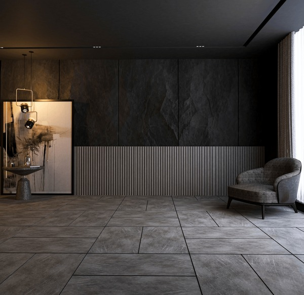
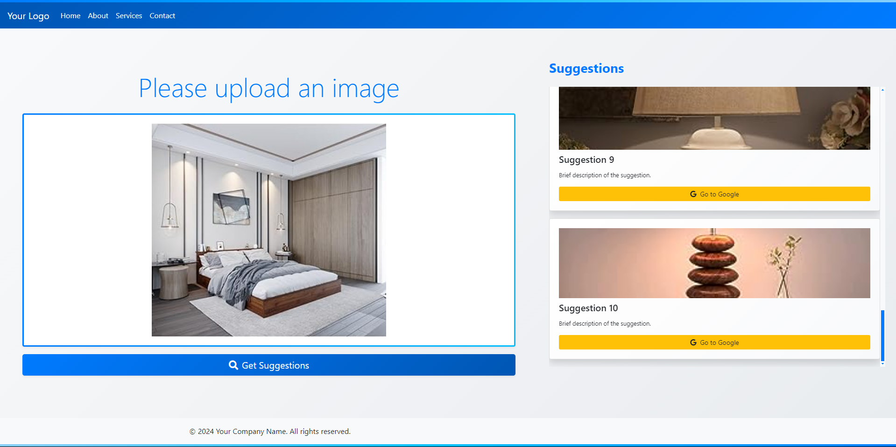
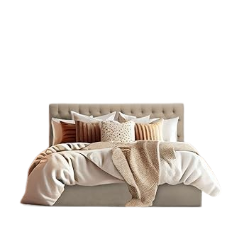
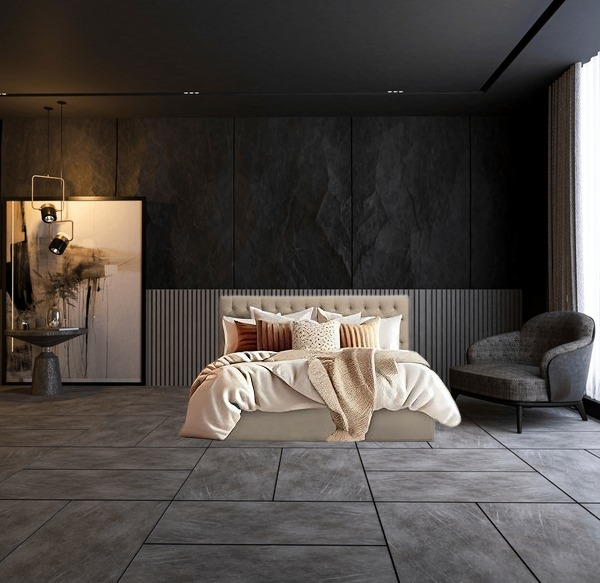
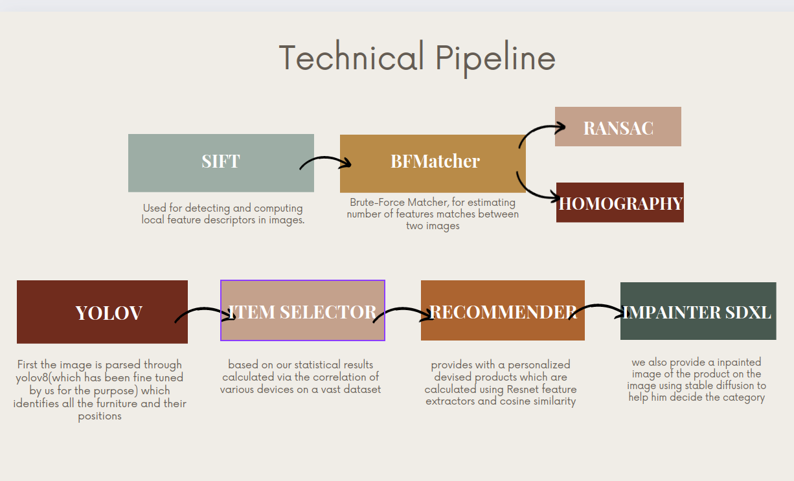

# Project Name: Interior Design Product Suggestions

## Overview

Welcome to the Interior Design Product Suggestions project! This tool aims to assist users in enhancing their interior spaces by providing personalized product recommendations based on photos of their interiors. By analyzing the uploaded photos, we suggest various products that users can choose from. Once a product is selected, we present detailed images and an option to redirect to Amazon for purchase.

## Features

- **Photo Upload:** Users can upload photos of their interior spaces.
  
- **Product Recommendations:** Based on the photo analysis, the tool suggests a range of products that complement the existing interior design.
- **Product Images:** Detailed images of the suggested products are provided for better visualization.
- **Select a Suggested Product:** After viewing the recommendations, the user can chosse a product they're interested in.
  
- **Place Virtually in Your Room:** The user can click on the "Place in Room" button to see the furniture placed in their uploaded photo of the interior .
  
- **Amazon Redirect:** Users can choose a product and be redirected to Amazon to make a purchase.

## Getting Started

### Prerequisites

To run this project, you need:

- Python 3.x
- Flask
- OpenCV
- A web browser

### Installation

Follow these steps to set up the project environment:

1. **Clone the Repository:**

   - Open your terminal.
   - Navigate to the directory where you want to clone the project.
   - Run `git clone <repository-url>`.

2. **Set Up a Virtual Environment:**

   - In the terminal, navigate to the project directory.
   - Create a virtual environment by running `python3 -m venv venv`.
   - Activate the virtual environment:
     - On Linux/macOS: `source venv/bin/activate`
     - On Windows: `.\venv\Scripts\activate`

3. **Install Dependencies:**
   - Ensure the virtual environment is activated.
   - Install the required packages by running `pip install -r requirements.txt`.

### Running the Application

1. **Start the Flask Server:**

   - In the terminal, ensure you are in the project directory and the virtual environment is activated.
   - Run the application by executing `python3 app.py`.
   - The terminal will display the local URL where the application is running (usually `http://127.0.0.1:5000`).

2. **Access the Application:**
   - Open your web browser.
   - Enter the URL provided by the Flask server.
   - The application should now be accessible, and you can follow the usage instructions to interact with it.

## Usage

1. **Upload a Photo:** Click on the upload button and select a photo of your interior.
2. **View Recommendations:** After the photo is processed, view the list of suggested products.
3. **Select a Product:** Choose a product to see detailed images.
4. **Visualize in Your Room:** Use the "Place in Room" feature to virtually position the selected furniture in your uploaded interior photo. Adjust the placement to see how it fits with your space.
5. **Purchase on Amazon:** Click the "Buy on Amazon" button to be redirected to the product page on Amazon.

